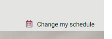
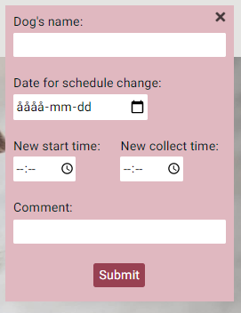

<h1>Dixie's Doggy Daycare</h1>

Dixie's Doggy Daycare is a site developt for "Dixie's", a daycare center for dogs living in Swindon, United Kingdom. The site describes and promotes the company and provides a way of communication between daycare owner and customers. The site's goal is to attract new customers, give current customers an easy way to make temporary changes to their schedule and to give the daycare owner an opportunity to post upcoming events. A visitor at the website will find a description of the day care centre, links to the daycare's social media pages, opening hours and prizes and also the centre's adress and phone number. Interested dog owners can fill out a form to make a preliminary application for a place at the centre.  
The site is built to be user friendly and easy to navigate and use, for first time as well as return visitors.
A live link to the website: https://odden69.github.io/dixies_doggy_daycare/

## Features
### Existing Features
#### Navigation Bar
The navigation bar can be found on top of each page, except for the apply here page, and is identical throuhgout the site to ensure user friendly navigation. It contains links to the Home, About us and Apply here pages and allows the user to easily navigate back and forth between the sites pages. The navigation bar is fully responsive across devices.  
  
The navigation bar also contains a Change Schedule Button which, when pushed, pops up a form where the customers can make temporary changes to their schedule. See a more thoroughly description below.

#### Front Page

- __Background Picture__
The front page consist of a background picture of Dixie herself in action. She is an Australian Shephard and the front face of Dixie's. The picture of this happy dog is choosen to give the reader a positive feeling and to influence intrested dog owners to keep reading and wanting to find out more about the daycare centre.

- __Cover Text__
The cover text holds a concise message to give the reader an instant understanding of what the site is all about.

- __What' Up__
What's Up is the bulletin board where the day care owner can post upcoming events and other information of interest to the customers.

#### Footer
The footer, like the header, is consictent throughout the site. It contains links to the daycare centres social media pages and adress and telephone number to the centre. It is also fully responsive across devices.  
  

The footer gives the owner a possibility to send the user on to other medias to provide other aspects of the centre. It also ensures that the correct address and phone number always is available to the reader.

#### Change Schedule Function
This feature meets a daycare centre customer's need to be able to easily make changes to his or her daycare schedule. When you wake up sick, the last thing you want to do is to start calling everyone who needs to know about the situation. Now there is one less call to make. Just go to the website and make a note in the form and that is taken care of.  
When the form has been filled out another note pops up to confirm the submission.  

  

This feature also benefits the owner who doesn't have to guard the phone in the mornings but instead allowing her to spend time with the dogs present.

#### About Us Page
The about us page contains a description of the daycare centre which goal is to ensure the reader of the centres qualities. It's intention is to give the reader a feeling that this small-scale daycare centre is flexible and competent and therefore capable of meeting every dog's needs.  
  

On this page the reader also can find opening hours and prizes.
The about us page gives the owner an opportunity to present the daycare centres capacity in a way that she finds relevant.

#### Apply Here Page
On the apply here page an interested dog owner can fill out a form to make a preliminary application to the daycare center. The form contains relevant information to the daycare owner and is a base for the discussions in a future contact. Some of the fields are required and some are not where the required ones are marked with an asterix.  
  
When the form has been filled out the user is sent to a thank you page described in the next chapter.  

The big logo provides a link back to the home page.  

The decision to make the page look like it does, without header and footer, was based on esthetic grounds and the fact that leaving out header and footer on a sign up page is very common on the web today.

#### Thank You Page
This page is only viewed as a result of submitting the application form the apply here page. It gives the user a confirmation of the submission and sends a positive message from the daycare centre.  
The thank you page has the same header and footer as the home page to let the user easily find the way back to the rest of the site.  

### Features Left to Implement
These are some features I would love to add to the site in the future:
- A calendar for the owner to post upcoming events in a more structured way with links to sign up pages for the events.
- A FAQ section.
- A page or section with references from present and past customers.  
Even further in the future there might be possible to add a more advanced communication tool where the customers have a log in and, among other things, can see posted pictures of their dog's day.

## Testing
The work with fixing the errors that first was the results of the validation is described in this document: validation-process.md
- __HTML__: In the end no errors were returned when passing through the official [Jigsaw Validator](https://validator.w3.org/nu/?doc=https%3A%2F%2Fodden69.github.io%2Fdixies_doggy_daycare%2F)
- __CSS__: No errors were returned when passing through the official [W3C Validator](https://jigsaw.w3.org/css-validator/validator?uri=https%3A%2F%2Fodden69.github.io%2Fdixies_doggy_daycare%2F&profile=css3svg&usermedium=all&warning=1&vextwarning=&lang=en)
- __Lighthouse__: The resluts of the lighthouse evaluation in the Chrome development tool can be found in validation-process.md.
- __Responsivity__: The Chrome development tool and the site https://responsivedesignchecker.com/ has been used to check the responsivity of the web-site. The site works all right on all the available predefined screen sizes. 
- __Compatibility__: The site has been checked for compatibility on Chrome, Edge, Firefox and Safari.

### Bugs left unfixed
There are som work left to be done on the Roboto font family. When testing the website on different browsers I realized that the bold font were not shown correctly since I hadn't added the bold font weight. It was not as easy as just adding it since the page did not behave the same anymore. This work will have to be done at a later stage.

## Deployment
This site was deployed to GitHub pages. To deploy a site follow these steps:
- Find the GitHub repository of the project you which to deploy.
- Click on Settings. The button to the far right in the menu.
- Scroll down and click on the Pages section.
- Under Source, select main in the dropdown menu.
- Click Save and the page will refresh automatically.
- To confirm your deployment, text on a blue ribbon will tell you: "Your site i ready to be published at  
https://odden69.github.io/dixies_doggy_daycare/

## Credits
### Code
A lot of inspiration to the coding was taken from "The coders coffeehouse" and "Love running" which are projects included in the course at Code Institute.  
To learn more about different elements or properties I ended up on mainly these pages: [W3schools](https://www.w3schools.com/), [CSS-TRICKS](https://css-tricks.com/) and [stackoverflow](https://stackoverflow.com/)

- The code for the Popup forms was taken from [W3schools](https://www.w3schools.com/howto/howto_js_popup_form.asp), even if I had to make quite a lot of adjustments to make it fill my needs.
- The code for the Back to Top button was taken from [W3schools](https://www.w3schools.com/howto/howto_js_scroll_to_top.asp) and was used almost unchanged.
- A way to create the square text fields on the about us page was found on [W3schools](https://www.w3schools.com/howto/howto_css_aspect_ratio.asp).

### Images
- All the images were downloaded from different open source sites.
  - The hero image: Photo by [Joséphine Menge](https://unsplash.com/@madamemenge?utm_source=unsplash&utm_medium=referral&utm_content=creditCopyText) on [Unsplash](https://unsplash.com/s/photos/dog?utm_source=unsplash&utm_medium=referral&utm_content=creditCopyText)
  - The Dalmatian puppy: [Freeimages](https://www.freeimages.com)
  - The two buddies: Photo by [Burst](href="https://stocksnap.io/author/burstshopify") on [StockSnap](href="https://stocksnap.io")
  - The two group pictures of dogs: Photo by [Blue Bird](https://www.pexels.com/sv-se/@blue-bird?utm_content=attributionCopyText&utm_medium=referral&utm_source=pexels) on [Pexels](https://www.pexels.com/sv-se/foto/kvinna-djur-hund-husdjur-7210705/?utm_content=attributionCopyText&utm_medium=referral&utm_source=pexels)
  - The Bernese Mountain Dog: [Unsplash](https://unsplash.com/)
- The favicon icon was generated on [Favicon](https://favicon.io/favicon-generator/).  
- The images were cropped using Windows Photos App and rezised using Microsoft Paint.  
- [Optimizilla](https://imagecompressor.com/) was used to compress the images.

### Other used applications
- The markdown was made in google documents and the document in pdf format could be read [here](assets/documents/markdown.pdf).
- I used [Adobe Color](https://color.adobe.com/) to draw a couple of main colours from the hero image and [coolors](https://coolors.co/) to generate a colour scheme from those colours.  
The contrast of the colour scheme was checked on [Contrast Grid](https://contrast-grid.eightshapes.com/?version=1.1.0&background-colors=&foreground-colors=%23FFFFFF%2C%20White%0D%0A984152%2C%20logo%20and%20button%0D%0Ac2b2b4%2C%20post-it%0D%0A465c69%0D%0A001414%2C%20text%0D%0Ac5fffd%2C%20%0D%0A%23e4e4e2%2C%20header%20footer&es-color-form__tile-size=compact&es-color-form__show-contrast=aaa&es-color-form__show-contrast=aa&es-color-form__show-contrast=aa18&es-color-form__show-contrast=dnp).
- The two fonts Pacifico, used for the logo, and Roboto, used for the text on the website, was taken from [Google Fonts](https://fonts.google.com/).
- Icons from [Font Awsome](https://fontawesome.com/) where used for the social media links and the change schedule icon.

## Special Thanks to
First of all I want to thank my Mentor, Maria Hynes, who has supported me through the project with lots of valuable advice and encouragement.  
The Tutors at Code Institue were there when I really got stuck and needed guidence. They supported me to find sollutions for problems with the sticky footer and responsivness on the About us page.  
A really big thank you to all my fellow slackers who are always there and ready to listen and give support, wether I am having a technical issue or just a need for mental support.  
I really don't want to mention any specific slacker, in case i miss someone, but I do have to mention ["Team Noiseland"](https://github.com/andrewdempsey2018/The-Never-Ending-Coding-Adventure-Codehog-Day), the amazing team I joined the 2021 Retro Gaming Hackathon of Code Institute with. The members have taken a lot of time to review and comment the project.