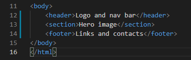

# The Development Process
This document describes the process of developing the Dixie's Doggy Daycare wbsite.

## Markdown
I started off by making a markdown in a regular google document. This is a link to the document in pdf format [Markdown](assets/documents/markdown.pdf).  
Some of the features that initially were added to the markdown were rejected of different reasons along the way.

## The colour scheme

## The landing page
After having started the index.html and managed to link it to a css file I started off with the landing page.  
Fist I just did the main structure of the page with header, section and footer.  
Then I started off with the header by adding the logo and the navigation links. The styling turned out alright
I had already decided to go for a background image of a happy dog. An Aussie running on a beach. I picked that picture because I liked the "happy face" of the dog, and I also found the colour scheme appealing.