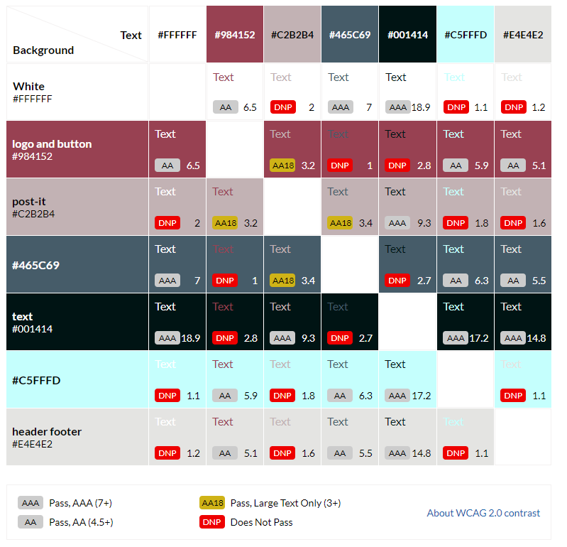

# The Validation Process
## CSS
No errors were found when running the style.css file through the test on jigsaw.w3.org.  

## HTML
All html pages were run through validator.w3.org.
### index.html
The first attempt of validating the index.html file gave these errors:  
  
- Error number 2 through 4 was caused by an easy mistake. I had forgotten to add id:s to the input fields of the change schedule form.
When those were added, the errors were solved.  
  
  
- Error number 1 was not obvious to me how to solve since I didn't have a database where to send the information or a thank you page where I could send the user. But this issue got solved by adding the javascripts, which closes the form and opens the thank you note, to the action.  

### about-us.html
The first attempt of validating the about-us.html file gave this error:  

- I had missed a semicolon after the pound sign. It was easily fixed.  

### apply-here.html
The first attempt of validating the apply-here.html file gave these errors:  
  
- Error number 4 and 5 was caused by me missing the id on input fields, again. The errors were fixed by just adding those.  
  

- Error number 1 through 3 took some iteration before it was solved.
  - First I focused on the tip "The first option element ... must have either an empty value attribute, or must have no text content" and tried to enter an extra empty option first.  
    
  But this only resulted in yet another, not very clear, error:  
  
  - Then I tried to approach the error with "Consider adding a size attribute..."  
    
  This worked as far as solving the error, but it gave an input field that didn't look very good in the browser.  
  
  - Ok, what do I do? I had to google "consider adding a placeholder option label" and found this page: [w3docs.com](https://www.w3docs.com/snippets/css/how-to-create-a-placeholder-for-an-html5-select-box-by-using-only-html-and-css.html)  
  With this help I tried adding placeholders on each select option.  
    
  Finally the errors were solved and the form looked good.  
    

### thank-you.html
No errors were found when running the thank-you.html file through the test on validator.w3.org.

## Lighthouse check
The result of the first lighthouse check on the mobile device was a bit low:  
  
- __Performance__: The issue shown in the lighthouse check was primarly the size of the hero image. I cropped the image and compressed it again.  
- __Accessibility__: The lighthouse check brought my attention to the spacing between the socialmeda icons so I increased the margin on those.
- __SEO__: I had missed the Aria labels on the navigation bar links.  

After taking these measures the result was much better:  

I was pretty happy with the lighthouse check on desktop:  
 

## Notepad++
I used Notepad++ to check the code for missing quotes. There I found one class and one id where I had missed the quotes:  

## Compatibility and Responsivity
I used the Chrome browser validation tool and the site https://responsivedesignchecker.com/ to do the responsivity checks.
The website is responsive to all sizes available on these sites.  

## Colour Scheme
The contrasts of the colour scheme was tested on [Contrast Grid](https://contrast-grid.eightshapes.com/?version=1.1.0&background-colors=&foreground-colors=%23FFFFFF%2C%20White%0D%0A984152%2C%20logo%20and%20button%0D%0Ac2b2b4%2C%20post-it%0D%0A465c69%0D%0A001414%2C%20text%0D%0Ac5fffd%2C%20%0D%0A%23e4e4e2%2C%20header%20footer&es-color-form__tile-size=compact&es-color-form__show-contrast=aaa&es-color-form__show-contrast=aa&es-color-form__show-contrast=aa18&es-color-form__show-contrast=dnp)  
.